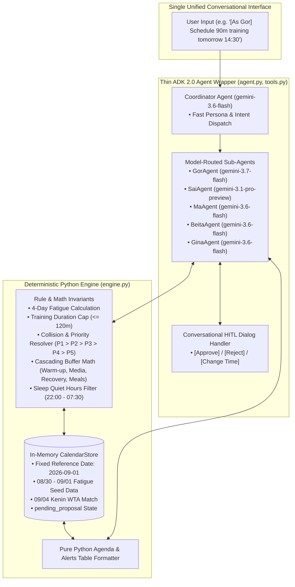
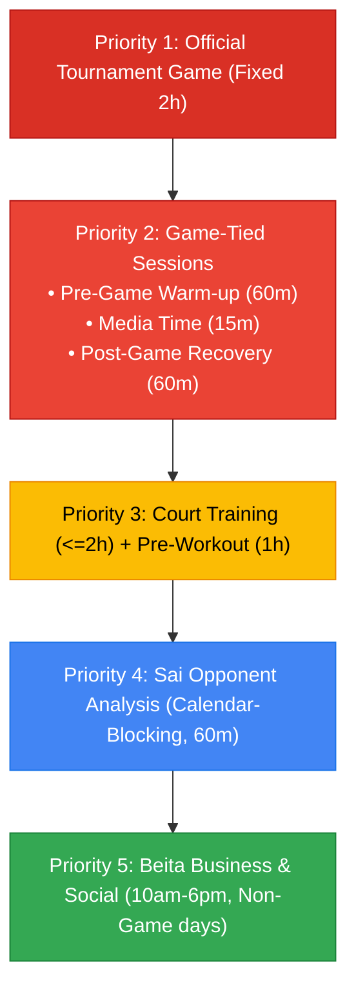
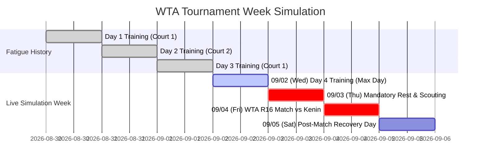
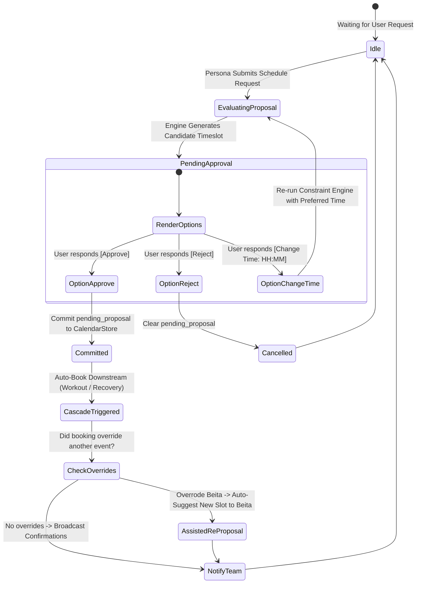

# System Architecture & Technical Design: `small-team-support-agent`
*(Final Production-Ready MVP Specification)*

---

## 1. Executive Summary & System Overview

The **`small-team-support-agent`** is an intelligent multi-persona assistant built on the **Google Agent Development Kit (ADK) 2.0** designed for deployment on the **Google Cloud Agent Platform** (Agent Runtime / Cloud Run).

The agent acts as the digital chief-of-staff for a professional WTA tennis player (**Gina**) and her dedicated support team:
- **Gina**: Top-level tennis player competing in WTA tournaments.
- **Gor**: Coach I (Head Coach) — responsible for court training curriculum, daily session design, and high-level strategy.
- **Sai**: Coach II — responsible for opponent tactical analysis, scouting sessions, and game-day warm-up execution.
- **Ma**: Physical Therapist — responsible for workout sessions, post-game cool-down/recovery, and nutritional meal planning.
- **Beita**: Personal Assistant — responsible for business contracts, PR interviews, media requests, and social activities.

The system solves multi-disciplinary scheduling conflicts, automates cascading schedule adjustments, resolves priority collisions, incorporates human-in-the-loop (HITL) approval gates, and protects athlete recovery via sleep quiet hours.

---

## 2. Core Architecture: "Thin ADK 2.0 Agent Wrapper + Deterministic Engine"

To eliminate scheduling hallucinations and date math errors, the architecture strictly separates **deterministic computation** from **natural language intelligence**:



### Division of Responsibilities

| Subsystem | Components | Primary Responsibilities |
| :--- | :--- | :--- |
| **Deterministic Engine** | `engine.py` | • Exact datetime and duration math ($\le 120$ mins)<br>• 4-day fatigue counter ($T-3, T-2, T-1$)<br>• Priority collision detection ($P1 > P2 > P3 > P4 > P5$)<br>• Cascading buffer calculations (Warm-up, Media, Recovery, Meals)<br>• Sleep Quiet Hours filtering (silencing 22:00–07:30)<br>• In-memory state persistence (`pending_proposal`) |
| **Thin ADK Wrapper** | `agent.py`, `tools.py` | • Natural language intent interpretation<br>• Persona switching and authorization checks<br>• Strategic Model Routing across sub-agents<br>• Human-in-the-loop interactive turn management<br>• Empathetic player briefings, tactical plans, and PR notifications |

---

## 3. Personas, Roles & Authorization Matrix

The application operates as a **single unified conversational interface** where any team member can interact with the agent. The active persona is identified via explicit tagging (e.g. `[As Gor]`, `[As Sai]`), natural language context, or stored session state (`session.state["current_persona"]`).

| Persona | Permitted Actions | Prohibitions / Guardrails | Downstream Automation |
| :--- | :--- | :--- | :--- |
| **Gina** *(Player)* | • Query nightly schedule for next day<br>• View active 1-hour pre-activity alerts<br>• View meal plan & game strategy | • Cannot create, edit, or override calendar events<br>• View-only permissions | Receives visual alerts preview; sleep quiet hours (22:00–07:30) protect rest |
| **Gor** *(Coach I)* | • Propose next-day training (time + syllabus)<br>• Review agent-recommended timeslots<br>• Approve/confirm training booking<br>• Override conflicting PR/business events | • Max 2-hour duration per training session<br>• Strictly blocked if Gina reached 4 consecutive active days<br>• Cannot train during tournament matches | Automatically books Ma's 1-hour pre-training workout; on game days, converts to pre-game warm-up |
| **Sai** *(Coach II)* | • Book calendar-blocking opponent analysis on day before game<br>• Input tactical strategy post-analysis<br>• Refine game-day warm-up plan | • Opponent analysis allowed only on day prior to game<br>• Cannot override core court training | Involves Gina in tactical video session; attaches strategy dossier to match event |
| **Ma** *(PT / Nutrition)* | • Input workout syllabus for auto-booked pre-training slots<br>• Confirm post-game cool-down recovery<br>• Input daily breakfast, lunch, dinner menus<br>• Trigger food orders | • Does not pick workout time on non-game days (auto-anchored 1h prior to training)<br>• Cannot violate game-day meal buffering (1h pre/post-match) | Auto-triggers mock food delivery order with dietary details |
| **Beita** *(PR / PA)* | • Request business/social slots for next day<br>• Manage auto-booked 15-min post-game media session | • Allowed strictly between 10:00 AM and 6:00 PM<br>• Prohibited before training on the same day<br>• Prohibited on game day and day before game day<br>• Overridable by Gor's training | If bumped by Gor's training, event is marked `BUMPED_BY_OVERRIDE` and agent automatically generates an assisted rescheduling proposal |

---

## 4. Strategic Model Routing Specification

ADK 2.0 assigns specialized Gemini models to sub-agents based on latency and reasoning depth:

| Agent Component | Model | Rationale & Task Characteristics | Cost / Latency Tier |
| :--- | :--- | :--- | :--- |
| **Coordinator Agent**<br>*(Triage & Router)* | **`gemini-3.6-flash`** | Needs sub-second latency (<300ms) to inspect persona tags, route user intents, and dispatch to sub-agents without complex reasoning. | Lowest Cost / Ultra-Fast |
| **GorAgent**<br>*(Training & Overrides)* | **`gemini-3.7-flash`** | Requires multi-constraint reasoning (4-day fatigue calculation, training duration caps, priority conflict resolution, and override negotiation). | High Reasoning / Fast |
| **SaiAgent**<br>*(Tactics & Scouting)* | **`gemini-3.1-pro-preview`** | Handles unstructured tactical scouting synthesis, opponent tendencies (e.g. Kenin's second serve patterns), and multi-point game strategy formulation. | Deep Reasoning / Heavy Context |
| **MaAgent**<br>*(PT & Nutrition)* | **`gemini-3.6-flash`** | Deterministic extraction of structured Pydantic schemas (meal plans, dietary macros, workout syllabus parsing). Fast and accurate. | Low Cost / Fast |
| **BeitaAgent**<br>*(PR & Assisted Rescheduling)* | **`gemini-3.6-flash`** | Schedule slot matching, daytime compliance checks, and prompt-driven assisted rescheduling templates. | Low Cost / Fast |
| **GinaAgent**<br>*(Briefing & Alerts)* | **`gemini-3.6-flash`** | Formats structured calendar events into human-readable tables, agendas, and enforces sleep quiet hour rules. | Low Cost / Fast |

---

## 5. Sports Science Priority Hierarchy & Constraint Rules

The scheduling engine enforces a strict priority hierarchy:
$$\text{Game (Priority 1)} > \text{Game Buffers (Priority 2)} > \text{Training / Workout (Priority 3)} > \text{Opponent Analysis (Priority 4)} > \text{Business / PR (Priority 5)}$$



### Rule Specifications

1. **4-Day Fatigue Guardrail:**
   - Evaluates activity history across $T-3, T-2, T-1$.
   - If Gina has trained or played on each of the past 4 consecutive days:
     $$\sum_{i=1}^{4} \mathbb{I}(\text{Activity}(T-i) \in \{\text{Training}, \text{Game}\}) = 4 \implies \text{Training}(T) = \text{BLOCKED}$$
   - Any court training request on day $T$ is strictly rejected with a mandatory rest recommendation.
2. **Training Session Duration:**
   - Single court training duration must not exceed **120 minutes (2 hours)**. Requests $> 120$ minutes are immediately rejected.
3. **Workout Coupling (Non-Game Days):**
   - Automatically books a 1-hour physical therapy workout for Ma immediately preceding Gor's court training:
     $$\text{Start}(\text{Workout}) = \text{Start}(\text{Training}) - 60\text{ min}, \quad \text{End}(\text{Workout}) = \text{Start}(\text{Training})$$
   - Ma does not request the time slot; the system books it and prompts Ma for the syllabus.
4. **Game-Day Buffer Cascades:**
   - For an official match (e.g. 14:00 – 16:00, 2 hours):
     - **Pre-Game Warm-Up:** 60 minutes, finishing 30 minutes before match time (12:30 – 13:30).
     - **Post-Game Media:** 15 minutes, starting immediately post-match (16:00 – 16:15).
     - **Post-Game Recovery:** 60 minutes, starting immediately after media (16:15 – 17:15).
5. **Meal Timing & Buffer Invariants:**
   - **Non-Game Day (Fixed):**
     - Breakfast: 07:00 – 07:30 (30 mins)
     - Lunch: 12:00 – 13:00 (1 hour)
     - Dinner: 18:00 – 19:00 (1 hour)
   - **Game Day (Dynamic Shift):**
     - Gina **must not eat within 1 hour before or 1 hour after match play**.
     - Lunch shifted to **11:30 – 12:15** (finishes $\ge 105$ mins before 14:00 match, and leaves 15 mins before 12:30 warm-up).
     - Dinner shifted to **18:00 – 19:00** (starts after 17:00 buffer and after 17:15 recovery).
6. **PR & Business Activity Rules (Beita):**
   - Allowed only between 10:00 AM and 6:00 PM.
   - Prohibited before court training on the same day.
   - Prohibited on game day and day before game day (blackout period).
   - **Assisted Rescheduling on Override:** If Gor requests a court slot that conflicts with a confirmed PR event, Gor can override it. The PR event is marked `BUMPED_BY_OVERRIDE`, and the engine immediately calculates and offers Beita the next compliant open timeslot (e.g. 16:30–17:30 or 17:30–18:30).
7. **Opponent Analysis Session (Sai):**
   - Allowed only on the **day before a match**.
   - **Calendar-Blocking**: 60 minutes (10:30 – 11:30 AM), reserving Gina, Gor, and Sai.
   - Sai inputs tactical strategy notes, which attach to the match dossier.
8. **Athlete Sleep Quiet Hours:**
   - Enforces a **Sleep Quiet Window (22:00 – 07:30)**.
   - Advance notifications during sleep hours (such as a 06:00 AM alert for 07:00 AM breakfast) are **silenced**.
   - Active alerts begin with daytime operational activities.

---

## 6. Tournament Simulation State & Timeline

To prevent the **Wall-Clock Trap**, the engine uses a fixed reference date:
- **`CURRENT_DATE = "2026-09-01"` (Tuesday - US Open Week)**



### Pre-Seeded Simulation State in `CalendarStore`

```python
INITIAL_STORE_STATE = {
    "current_date": "2026-09-01",
    "fatigue_history": [
        {"date": "2026-08-30", "event_type": "TRAINING", "title": "Court 1 Training"},
        {"date": "2026-08-31", "event_type": "TRAINING", "title": "Court 2 Training"},
        {"date": "2026-09-01", "event_type": "TRAINING", "title": "Court 1 Training"},
    ],
    "tournament_matches": [
        {
            "id": "match_kenin_r16",
            "date": "2026-09-04",
            "start_time": "14:00",
            "end_time": "16:00",
            "opponent": "Sofia Kenin",
            "round": "Round of 16",
            "court": "Grandstand Court",
            "event_type": "GAME",
            "priority": 1,
        }
    ],
    "fixed_meals": {
        "breakfast": ("07:00", "07:30"),
        "lunch": ("12:00", "13:00"),
        "dinner": ("18:00", "19:00"),
    },
}
```

---

## 7. Deterministic Human-in-the-Loop (HITL) State Machine

When an action requires confirmation, proposal details are cached in `CalendarStore.pending_proposal`. When the user responds with `[Approve]`, the exact parameters are committed.



### HITL Interaction Examples

#### Example 1: Gor Books Training
```text
Agent: "Gor, for Wednesday 09/02:
Recommended Training Slot: 14:30 - 16:00 (Court 3, 90 mins).
Note: Ma's pre-training workout will be auto-booked from 13:30 - 14:30.
Options:
• [Approve]
• [Reject]
• [Change Time: <preferred time>]"

Gor: "[Approve]"

Agent: "Confirmed! Training booked for 14:30 - 16:00 on 09/02.
• Ma's workout booked for 13:30 - 14:30 (Ma prompted for syllabus).
• Team calendar updated."
```

#### Example 2: Gor Overrides Beita with Assisted Rescheduling
```text
Agent: "Gor, Court 1 is requested for 16:30 - 17:30, but conflicts with Beita's Sponsor Shoot (16:30 - 17:30).
Training (Priority 3) has higher priority than PR/Social (Priority 5).
Options:
• [Approve Override] (Confirms training; bumps Beita's event and immediately offers her a new slot)
• [Reject]
• [Change Time: Morning slot 09:30 - 11:30]"

[When Gor approves Override]
Agent -> Beita: "Beita, your 16:30 Sponsor Shoot was bumped by Gor's training.
I scanned the calendar and found a compliant open slot today: 17:30 - 18:30 (Court Media Suite).
Options:
• [Approve Alternative: 17:30 - 18:30]
• [Reject / Request Other Time]"
```

---

## 8. Pure Python Agenda & Alert Formatter (Sleep Quiet Hours)

Generated deterministically by `get_daily_schedule_and_alerts(date)` in `engine.py`.

```text
================================================================================
🎾 GINA'S DAILY SCHEDULE: Wednesday, September 02, 2026
================================================================================
07:00 - 07:30 | 🍳 Breakfast (Oatmeal with berries & almond butter)
12:00 - 13:00 | 🥗 Lunch (Grilled chicken breast, quinoa, steamed broccoli)
13:30 - 14:30 | 🏋️ Pre-Training Workout with Ma (Core stability & hip mobility)
14:30 - 16:00 | 🎾 Court Training with Gor (Baseline consistency & serve +1)
16:30 - 17:30 | 📸 Sponsor Photo Shoot with Beita (Wilson Brand Media)
18:00 - 19:00 | 🥩 Dinner (Grilled salmon, sweet potato, green salad)
22:00         | 🌙 Sleep & Recovery

--------------------------------------------------------------------------------
🔔 ACTIVE ALERTS & REMINDERS (1-Hour Pre-Activity Alerts)
[Policy: Sleep Quiet Hours active 22:00 - 07:30. Early breakfast alarm silenced.]
--------------------------------------------------------------------------------
| Trigger Time | Scheduled Event | Location / Notes | Alert Recipient |
| :--- | :--- | :--- | :--- |
| --:-- (Silent)| 07:00 AM Breakfast | Dining Lounge (Silent for Sleep) | Gina |
| 11:00 AM | 12:00 PM Lunch | Dining Lounge | Gina |
| 12:30 PM | 01:30 PM Pre-Training Workout | Gym / PT Room | Gina, Ma |
| 01:30 PM | 02:30 PM Court Training | Court 3 | Gina, Gor |
| 03:30 PM | 04:30 PM Sponsor Photo Shoot | Media Suite A | Gina, Beita |
| 05:00 PM | 06:00 PM Dinner | Dining Lounge | Gina |
================================================================================
```

---

## 9. Lean 4-Module Code Layout & Data Models

```
/home/admin_/agent-demo/small-team-support-agent/
├── app/
│   ├── __init__.py
│   ├── models.py          # Pydantic schemas (CalendarEvent, MealPlan, Enums)
│   ├── engine.py          # Deterministic CalendarStore, Fatigue, Buffers & Formatter
│   ├── tools.py           # ADK 2.0 FunctionTools wrapping the engine
│   └── agent.py           # ADK Coordinator Agent & Persona Sub-Agents (Model Routed)
├── tests/
│   └── eval/
│       ├── datasets/
│       │   └── team_support_eval.json # Canonical evaluation dataset for all personas
│       └── eval_config.yaml           # LLM-as-judge rubric metric configuration
├── run_demo.py            # Interactive terminal CLI with colored persona switcher
├── verify_demo.py         # Automated deterministic test runner (TC-01 through TC-11)
├── run_eval.py            # Automated LLM-as-a-judge behavioral evaluation runner
├── docs/
│   └── design_spec_small_team_support_agent.md
├── README.md              # Project documentation and usage guide
└── pyproject.toml         # Package definition (google-adk, pydantic)
```

### Core Pydantic Schemas (`app/models.py`)

```python
from enum import Enum
from typing import Optional, List
from pydantic import BaseModel, Field


class EventType(str, Enum):
    GAME = "GAME"
    PRE_GAME_WARMUP = "PRE_GAME_WARMUP"
    POST_GAME_MEDIA = "POST_GAME_MEDIA"
    POST_GAME_RECOVERY = "POST_GAME_RECOVERY"
    TRAINING = "TRAINING"
    WORKOUT = "WORKOUT"
    OPPONENT_ANALYSIS = "OPPONENT_ANALYSIS"
    BUSINESS_SOCIAL = "BUSINESS_SOCIAL"
    MEAL = "MEAL"


class EventStatus(str, Enum):
    PENDING_APPROVAL = "PENDING_APPROVAL"
    CONFIRMED = "CONFIRMED"
    BUMPED_BY_OVERRIDE = "BUMPED_BY_OVERRIDE"
    CANCELLED = "CANCELLED"


class CalendarEvent(BaseModel):
    id: str
    date: str  # YYYY-MM-DD
    start_time: str  # HH:MM
    end_time: str  # HH:MM
    event_type: EventType
    title: str
    syllabus_or_notes: Optional[str] = None
    requested_by: str  # Gina, Gor, Sai, Ma, Beita, System
    priority: int  # 1 (Highest) to 5 (Lowest)
    status: EventStatus = EventStatus.CONFIRMED
    overridable: bool = False


class MealPlan(BaseModel):
    date: str
    breakfast_items: List[str]
    lunch_items: List[str]
    dinner_items: List[str]
    order_id: Optional[str] = None
    status: str = "ORDERED"
```

---

## 10. Step-by-Step End-to-End Verification Matrix (TC-01 to TC-11)

| Test ID | Persona | Action / Prompt | Expected System Behavior |
| :--- | :--- | :--- | :--- |
| **TC-01** | `Gina` | *"What is my schedule for tomorrow (09/02)?"* | Returns complete chronological agenda. Verifies **Sleep Quiet Hours** suppress 06:00 AM breakfast alarm, showing active daytime alerts starting after 07:30. |
| **TC-02** | `Gor` | *"Schedule 2.5 hour serve training on 09/02"* | **Rejected**: Exceeds 2-hour maximum training duration limit. |
| **TC-03** | `Gor` | *"Schedule 90-min training on 09/02 at 14:30"* | Generates proposal. On `[Approve]`: books training (14:30–16:00) AND auto-books Ma's workout (13:30–14:30). |
| **TC-04** | `Ma` | *"Workout syllabus for 09/02: Core stability and hip mobility"* | Successfully attaches syllabus to the auto-booked 13:30 workout event. |
| **TC-05** | `Ma` | *"Meal plan for 09/02: Oatmeal breakfast, Salmon lunch, Steak dinner"* | Records meals; triggers mock food delivery order with confirmation ID. |
| **TC-06** | `Beita` | *"Book sponsor meet-and-greet on 09/02 at 11:00 AM"* | **Rejected**: Prohibited before court training. Proposes afternoon slot (16:30). Beita books 16:30–17:30. |
| **TC-07** | `Gor` | *"Schedule court training on 09/03"* | **Rejected**: 4-day fatigue rule triggered (08/30–09/02 consecutive). Mandatory rest day before 09/04 match. |
| **TC-08** | `Sai` | *"Book opponent analysis on 09/03 for Kenin match"* | **Approved**: Books calendar-blocking session (10:30–11:30 AM). Sai inputs match tactics. |
| **TC-09** | `System`| *Tournament announcement: WTA Match vs Kenin on 09/04 at 14:00* | Cascades auto-bookings: Warm-up (12:30–13:30), Media (16:00–16:15), Recovery (16:15–17:15), shifts Lunch (11:30–12:15) & Dinner (18:00–19:00), enforces PR blackout. |
| **TC-10** | `Beita` | *"Book brand interview on 09/04 at 17:00"* | **Rejected**: Social/PR activities prohibited on match days. |
| **TC-11** | `Gor` | *Conflict scenario: Gor requests late training slot on 09/02 (16:30–17:30) overlapping Beita's PR event* | Agent offers override option. On `[Approve Override]`: books training, marks Beita's event `BUMPED_BY_OVERRIDE`, and **automatically delivers an assisted rescheduling proposal** to Beita for the next open slot (17:30–18:30). |

---

## 11. Production GCP Deployment & Cloud Architecture (Implemented MVP)

The system is fully containerized and architected for enterprise deployment on Google Cloud:
1. **Containerization & Deployment**: Dockerized via Python 3.12-slim and deployable to **Google Cloud Run** or **Agent Runtime** using `agents-cli deploy`.
2. **Database & Memory Persistence**: Real-time conversational state persisted to **Google Cloud Firestore (Native Mode)** (`/agent_sessions`, `/team_memories`) with graceful local in-memory fallback.
3. **Serving Surfaces**: Dual-stack serving providing native ADK Web SSE routes alongside Agent2Agent (A2A) JSON-RPC and agent card endpoints.
4. **Enterprise Observability**: Distributed tracing via OpenTelemetry, Cloud Logging-compliant structured JSON logging, domain intent & outcome tracking, and automated PII scrubbing.

---

## 12. Behavioral Agent Evaluation Specification (`agents-cli eval`)

While `verify_demo.py` ensures deterministic code correctness (unit & math invariants), agent behavioral quality, tool-calling trajectory, and persona tone are evaluated via the **Agent Development Kit / Google Agent Platform Evaluation framework**.

### 12.1 Evaluation Dataset (`tests/eval/datasets/team_support_eval.json`)
Adheres to the canonical `EvaluationDataset` schema (`eval_cases` with `prompt`, `reference`, `expected_tool`, and per-case `rubric_groups`). Covers:
- **`eval_tc01_quiet_hours`** (Gina): Validates that 06:00 AM breakfast alarm is suppressed during quiet hours (22:00–07:30).
- **`eval_tc02_training_cap`** (Gor): Validates rejection of requests exceeding the 120-minute cap.
- **`eval_tc03_training_coupling`** (Gor): Validates autonomous coupling of Ma's 1-hour pre-training workout.
- **`eval_tc04_workout_syllabus`** (Ma): Validates physical therapy syllabus attachment.
- **`eval_tc05_meal_order`** (Ma): Validates nutrition planning and mock food order generation.
- **`eval_tc06_pr_training_conflict`** (Beita): Validates rejection of morning PR slots preceding court training and afternoon slot suggestion.
- **`eval_tc07_fatigue_guardrail`** (Gor): Validates 4-day fatigue rule rejection on Day 5.
- **`eval_tc08_tactical_scouting`** (Sai): Validates scouting booking on pre-match day.
- **`eval_tc09_match_cascades`** (Gina): Validates match-day cascading buffers (warm-up, media, recovery, meal shifts).
- **`eval_tc10_match_pr_blackout`** (Beita): Validates PR blackout on match day.
- **`eval_tc11_priority_override`** (Gor): Validates priority override ($P3 > P5$) and assisted rescheduling recommendation for Beita.

### 12.2 Metrics & Rubrics Configuration (`tests/eval/eval_config.yaml`)
- **`persona_tone_and_quality`**: LLM-as-a-judge metric evaluating persona voice, empathy, clarity, and markdown structure (1–5 scale).
- **`domain_rules_and_safety`**: LLM judge metric verifying athletic recovery safety, quiet hours, fatigue blocks, and invariant adherence (1–5 scale).
- **`tool_call_accuracy`**: Verifies accurate tool invocation and result reporting.

### 12.3 Execution & Artifacts (`run_eval.py`)
- Automated evaluation runner executing cases against live models (`gemini-3.6-flash`, `gemini-3.7-flash`, `gemini-3.1-pro-preview`).
- Outputs timestamped reports to `artifacts/eval_results/results_<timestamp>.json` and human-readable `results_<timestamp>.html`.

---

## 13. Cloud Architecture & Enterprise Serving Surface

### 13.1 Cloud Firestore Native Persistence & Team Memory Bank
- **Session State**: Conversational turns and state transitions are optionally persisted to Cloud Firestore Native Database (`(default)` in `us-central1`) via `FirestoreSessionService`.
- **Memory Bank**: Cross-session long-term athlete facts (e.g. dietary preferences, recovery sleep rules, coaching tactics, sponsor photo shoot hours) are indexed in the `team_memories` Firestore collection with dynamic semantic search.
- **In-Memory Fallback**: Seamless fallback to local in-memory session management when `USE_FIRESTORE=false` or when running outside GCP.

### 13.2 Conversation History Compaction
To avoid token bloat during multi-turn tournament scenarios, all persona sub-agents utilize ADK's `EventsCompactionConfig(token_threshold=16000, event_retention_size=5)`. When conversation history exceeds 16,000 tokens, older turns are automatically compacted into state summaries while retaining the last 5 active events.

### 13.3 Containerized Serving Surface (FastAPI & A2A)
- **FastAPI Application (`app/fast_api_app.py`)**: Exposes standard ADK HTTP routes (`/run_sse`, `/apps/app/...`).
- **A2A Protocol**: Exposes Agent-to-Agent JSON-RPC endpoints and dynamic agent cards (`/a2a/app/.well-known/agent-card.json`) allowing external autonomous agent interop.
- **Docker Packaging**: Containerized via single-stage Python 3.12-slim Dockerfile optimized with `uv`.

### 13.4 Security & Secrets Governance
- Plaintext key fallbacks from local disk (e.g. `~/gemini_key.txt`) are prohibited.
- Local execution relies on `.env` (gitignored).
- GCP Cloud Run / Agent Runtime deployments utilize Application Default Credentials (ADC) or GCP Secret Manager.

### 13.5 Code Quality & Linting Standards
The codebase adheres strictly to Python 3.12 standards and is validated using **Ruff** for linting and formatting (`ruff check .`, `ruff format --check .`).

### 13.6 Enterprise Observability, Distributed Tracing & PII Redaction
- **Structured JSON Logging (`app/observability.py`)**: Replaced standard Python string logging with NDJSON logging strictly adhering to Google Cloud Logging schemas with automatic trace context correlation (`logging.googleapis.com/trace`, `logging.googleapis.com/spanId`).
- **Distributed Tracing (OpenTelemetry)**: Full span instrumentation across agent turns (`agent_turn`), tool executions (`tool.*`), and HTTP endpoints (`structured_http_logging_middleware`) with latency analysis and error code tagging.
- **Intent & Outcome Taxonomy**: Explicit domain intent categorization (`AgentIntent`) and execution guardrail outcome tracking (`ExecutionOutcome`) across all operations.
- **Automated PII Redaction (`PIIRedactor`)**: Automated pattern and structural scrubbing of GitHub tokens, Google API keys, Bearer auth headers, emails, phone numbers, payment cards, SSNs, and sensitive dictionary keys prior to log emission.
- **Unit Verification (`tests/unit/test_observability.py`)**: Automated test suite verifying PII scrubbing, intent classification, and tracing span lifecycle.

### 13.7 Asynchronous Background Memory Generation & Consolidation
- **Non-Blocking Memory Extraction (`schedule_memory_generation`)**: Evaluates completed turns in background tasks (`asyncio.create_task`) without adding latency to user requests. Categorizes insights across athlete preferences, sleep rules, coaching invariants, opponent scouting directives, and sponsor terms.
- **Background Memory Consolidation (`consolidate_memories_async`)**: Periodic (every 300s) and threshold-triggered background worker deduplicating near-duplicate facts using normalized token fingerprinting and Jaccard similarity, resolving conflicting facts, and compacting knowledge state.
- **Asynchronous Storage Synchronization**: Non-blocking batch writes to Cloud Firestore (`team_memories`) and concurrency-safe local state (`asyncio.Lock`).
- **REST Telemetry & Control**: Endpoints `POST /memory/consolidate` and `GET /memory/stats` for real-time observability and on-demand trigger.
- **Unit Verification (`tests/unit/test_memory_management.py`)**: Comprehensive automated tests verifying async generation, deduplication pruning, non-blocking task dispatch, and memory bank statistics.


